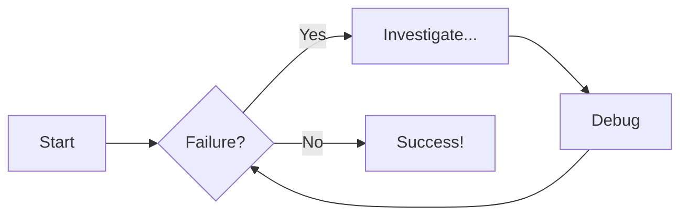
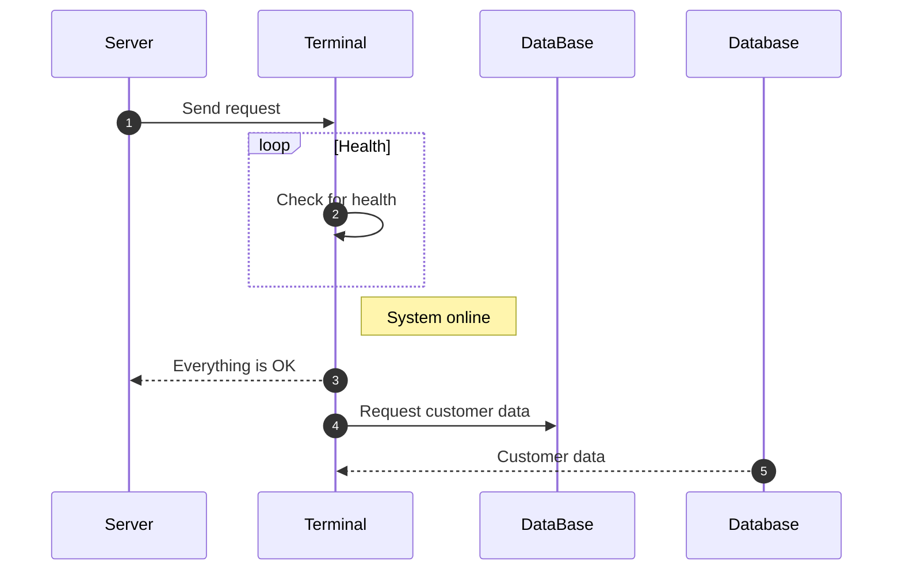

<!--
 * @Author: ShihangWu 2478677199@qq.com
 * @Date: 2025-10-24 23:16:37
 * @LastEditors: ShihangWu 2478677199@qq.com
 * @LastEditTime: 2025-10-24 23:26:47
 * @FilePath: \my-project\docs\diagram-examples.md
 * @Description: 这是默认设置,请设置`customMade`, 打开koroFileHeader查看配置 进行设置: https://github.com/OBKoro1/koro1FileHeader/wiki/%E9%85%8D%E7%BD%AE
-->
# Diagram Examples

## Flowcharts

## Sequence Diagrams

